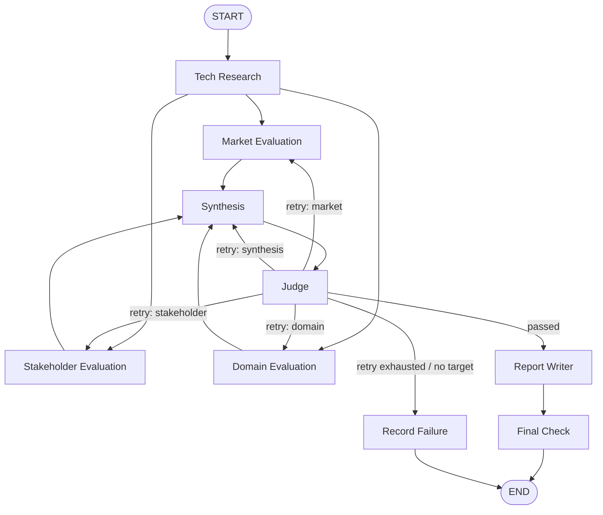

# TurboQuant · ITME — KV cache 기술 비교 평가 시스템

# Subject

**TurboQuant·ITME Agentic RAG**는 KV Cache 최적화 기술을 소프트웨어(TurboQuant)와 하드웨어(ITME) 관점에서 비교하는 근거 기반 Multi-Agent 시스템이다. GPU 데이터센터의 기업 문서 질의응답(QA) 환경을 대상으로 웹 검색과 문서 검색 결과를 시장·이해관계자·도메인 관점에서 평가하고, 출처가 연결된 보고서를 생성한다.

## Overview

- **Objective** : TurboQuant와 ITME를 복수 관점에서 근거 기반으로 비교·평가
- **Method** : LangGraph 기반 Multi-Agent 워크플로와 Agentic RAG
- **Domain** : GPU 데이터센터에서 운영하는 기업 문서 질의응답 서비스
- **Tools** : LangGraph, OpenAI Chat Completions, Tavily, PyMuPDF, SQLite, NumPy, Pydantic

## Selected Technologies

- **SW: TurboQuant** — 낮은 비트 저장 표현과 양자화 오차 제어를 통해 LLM 추론 시 KV Cache 저장량을 줄이는 소프트웨어 기술이다.
- **HW: ITME** — CXL 기반의 분리형 하이브리드 메모리 계층을 이용해 KV Cache의 보관과 이동을 확장하는 하드웨어 기술이다.

두 기술은 동일한 KV Cache 병목을 서로 다른 계층에서 다룬다. 저장소의 문서 매니페스트와 평가 프롬프트는 이 차이를 GPU 데이터센터 기업 문서 QA라는 공통 도메인에서 비교하도록 구성되어 있으며, 특정 기술의 우위를 전제하지 않는다.

## Features

- **웹 조사와 출처 기록**
  - Tavily 검색 결과를 정규화하고 재시도하며, 선택적으로 로컬 캐시를 사용한다.
  - 모든 검색 호출은 성공·실패 여부를 포함한 `QueryLog`로 기록된다.
  - 검색 문서는 안전하게 escape한 `<document>` 블록으로 모델에 전달된다.

- **문서 수집·검색 파이프라인**
  - PyMuPDF로 PDF의 본문·표·그림 정보를 추출하고 구조 검토 데이터를 반영한다.
  - 문서 구조를 고려해 chunk를 만들고 multilingual E5 임베딩을 생성한다.
  - SQLite 기반 dense store에서 metadata pre-filter 후 NumPy cosine similarity로 Top-K를 검색한다.
  - RAG subgraph는 검색 결과를 평가하고, 근거가 부족하면 질의를 재작성해 제한된 횟수만큼 다시 검색한다.

- **Multi-Agent 평가**
  - 기술 조사 후 Market, Stakeholder, Domain 평가를 병렬로 실행한다.
  - Synthesis가 세 관점의 합의점·충돌·기술별 결론을 종합한다.
  - Judge는 코드 기반 최소 근거 규칙과 LLM 기반 groundedness·neutrality 검사를 수행하고, 필요한 노드로 재시도를 라우팅한다.
  - Report Writer와 Final Check가 보고서를 구성하고 인용·수치·중립성·TRL 표기를 점검한다.

- **근거 추적과 보수적 서술**
  - LLM은 URL을 생성하지 않고 `result_index`로 검색 결과를 선택한다. 코드는 이를 실제 `source_key`와 `Evidence`로 연결한다.
  - Evidence ID, 출처 유형, stance, scope, self-reported 여부, 조사 round를 상태에 보존한다.
  - 검색 실패와 검색 성공 후 무결과를 구분하며, 근거가 부족하면 임의의 사실 대신 uncertainty를 남긴다.

- **확증 편향 완화**
  - 두 기술에 동일한 query template을 적용한다.
  - Market 평가는 기술별로 positive 2회, negative 2회, neutral 2회 등 최대 6회의 초기 검색을 수행한다.
  - Stakeholder 평가는 competitor, adopter/developer, investor/industry 각 그룹에 positive·negative·neutral 의도를 적용해 기술별 최대 9회 검색한다.
  - Validation issue가 주어지면 평가 Agent가 기술별 상한 안에서 보완 검색 또는 근거 범위에 맞춘 rewrite를 수행한다.

- **실행 복구**
  - LLM 노드에 LangGraph `RetryPolicy`를 적용한다.
  - SQLite checkpoint와 `thread_id`로 동일 실행을 실패 지점부터 재개할 수 있다.

## Tech Stack

- **Agent Framework** : LangGraph, LangChain Core
- **Generator LLM** : `langchain-openai`의 `ChatOpenAI` (`GENERATOR_MODEL` 환경 변수로 지정)
- **Judge LLM** : `langchain-openai`의 `ChatOpenAI` (`JUDGE_MODEL` 환경 변수로 지정, temperature 0)
- **Web Search** : Tavily Search API
- **Embedding** : `intfloat/multilingual-e5-base`, 768 dimensions, 최대 512 tokens
- **Vector Store** : 프로젝트 내 SQLite `DenseStore`와 NumPy exact cosine search
- **PDF Parsing** : PyMuPDF
- **Schema / Validation** : Pydantic
- **Checkpoint** : LangGraph SQLite checkpointer
- **Testing** : pytest
- **Retrieval Evaluation** : Hit Rate@5와 MRR@5 평가 코드 제공

구체적인 Generator/Judge 모델 ID는 저장소에 고정되어 있지 않으며 실행 환경에서 주입한다. Embedding revision과 실행 조건은 [`data/manifest.json`](data/manifest.json)에 고정되어 있다.

## Agents

- **Tech Research Agent (`tech_research`)**
  - TurboQuant와 ITME의 기술 원리, 특성, 한계 및 TRL 관련 근거를 RAG와 웹 검색으로 조사한다.

- **Market Evaluation Agent (`market_eval`)**
  - 시장 수요, 성장성, 상용화, 생태계와 경제성을 positive·negative·neutral 관점으로 평가한다.

- **Stakeholder Evaluation Agent (`stakeholder_eval`)**
  - 경쟁 진영, 도입 기업·개발자, 투자·산업 관계자 관점의 이해관계와 반응을 조사한다.

- **Domain Evaluation Agent (`domain_eval`)**
  - GPU 데이터센터 기업 문서 QA 환경에서 성능, 운영성, 비용, 보안·규제 측면의 적용성을 평가한다.

- **Synthesis Agent (`synthesis`)**
  - 세 평가 관점의 결과를 비교해 합의점, 충돌, 기술별 종합 결론과 uncertainty를 작성한다.

- **Judge (`judge`)**
  - 출처 수·다양성·독립성, negative 검색, TRL 등 규칙 기반 조건과 LLM 기반 groundedness·neutrality를 검증하고 재시도 대상을 결정한다.

- **Report Writer (`report_writer`)**
  - 검증된 평가와 Evidence를 바탕으로 요약, 비교 결과, 제약 및 참고문헌을 포함한 보고서를 생성한다.

- **Final Check (`final_check`)**
  - 보고서의 섹션 순서, 인용, 수치 근거, 중립 표현, TRL 표기를 한 차례 점검·보정하고 실제 인용된 출처로 참고문헌을 재구성한다.

- **Record Failure (`record_failure`)**
  - 허용된 재시도 후에도 검증을 통과하지 못한 실행의 issue와 상태를 파일로 기록한다.

## Architecture

현재 [`graph/builder.py`](graph/builder.py)의 노드와 조건부 라우팅은 다음과 같다.



`app.py`는 이 graph를 SQLite checkpointer와 함께 compile한다. 동일한 `thread_id`를 다시 사용하면 저장된 checkpoint를 읽어 완료되지 않은 실행을 이어간다.

## Directory Structure

```text
.
├── agents/              # 조사·평가·종합·보고서 Agent
├── common/              # Evidence ID와 validation issue 공통 규칙
├── data/                # 문서 manifest와 구조 검토 데이터
├── fixtures/            # 상태 전이·평가용 fixture
├── graph/               # State, graph builder, routing
├── nodes/               # Judge, final check, failure 기록
├── outputs/             # checkpoint, cache, 실행 결과
├── prompts/             # Agent/Node별 prompt
├── rag/                 # PDF ingestion, embedding, retrieval, RAG subgraph, 평가
├── tests/               # 단위·통합 테스트
├── tools/               # Tavily 웹 검색 wrapper
├── app.py               # 애플리케이션 entry point
├── config.py            # 모델·검색·재시도 설정
└── requirements.txt
```

## Usage

### 설치

```bash
python -m venv .venv
source .venv/bin/activate
python -m pip install -r requirements.txt
```

로컬 E5 모델을 사용해 RAG 색인을 생성·조회하려면 별도의 runtime 의존성도 설치한다.

```bash
python -m pip install -r rag/requirements-runtime.txt
```

### 환경 설정

```bash
cp .env.example .env
```

`.env`에 아래 값을 설정한다. 실제 secret은 저장소에 커밋하지 않는다.

- `OPENAI_API_KEY` : Generator/Judge LLM 호출
- `TAVILY_API_KEY` : 웹 검색
- `GENERATOR_MODEL` : 조사·평가·종합·보고서 생성 모델 ID
- `JUDGE_MODEL` : Judge와 Final Check 모델 ID
- `USE_CACHE` : 웹 검색 캐시 사용 여부, 기본값 `true`

### 실행

```bash
python app.py --thread-id demo
```

`--thread-id`를 생략하면 새로운 ID가 생성된다. 같은 ID로 다시 실행하면 `outputs/checkpoints.sqlite`의 checkpoint에서 재개한다. 성공 시 `outputs/final_report.md`, `outputs/final_check_log.json`, `outputs/run_meta.json`이 생성되며, 검증 실패 시 `outputs/validation_failure.json`이 기록된다.

## Tests

```bash
python -m pytest -q
```

최신 `main` 커밋에서 외부 API key를 비운 오프라인 실행 결과는 **319 passed, 2 skipped, 2 failed**이다. 실패 2건은 Judge 구현 이후에도 빈 근거 상태가 최종 보고서까지 도달한다고 가정하는 `tests/test_graph.py`의 기존 통합 테스트 기대값과 현재 validation routing의 차이에서 발생한다.

Retrieval 평가는 Hit Rate@5와 MRR@5를 계산하도록 구현되어 있으나, 현재 golden QA의 사람 검수 라벨과 확정 성능 결과는 저장소에 포함되어 있지 않다.

## Contributors

- **이도권**
  - LangGraph state·builder·routing, 공통 계약, retry/checkpoint와 `thread_id` 재개, 애플리케이션 entry point 및 실패 기록 통합

- **김보석**
  - PDF parsing·구조 기반 chunking, multilingual E5 embedding, SQLite dense store, retrieval/RAG subgraph와 retrieval 평가 코드

- **김선주**
  - Tavily 웹 검색 wrapper, Tech Research Agent, QueryLog, 검색 재시도·캐시·URL 정규화·document wrapping

- **김주은**
  - Market/Stakeholder Evaluation Agent, 평가 공통 로직, 보완 검색·rewrite·closed 처리, Evidence/source 연결과 관련 테스트

- **장인우**
  - Domain Evaluation Agent, Synthesis Agent, Report Writer와 관련 prompt·테스트

- **조영우**
  - Judge의 규칙·LLM 검증 및 재시도 판정, Final Check의 인용·수치·중립성 검증과 관련 테스트
