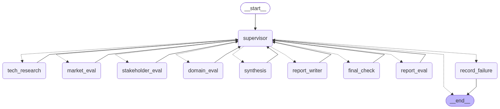

# Subject

본 프로젝트는 KV Cache 최적화 기술을 소프트웨어(**TurboQuant**)와 하드웨어(**ITME**) 두 진영에서 선정하여,
기술 성숙도·시장·이해관계자·도메인 관점에서 평가하는 **Supervisor 패턴** 기반 Multi-Agent 시스템을 설계/개발하는 프로젝트이다.
평가 도메인은 *GPU 데이터센터에서 운영하는 기업 문서 질의응답(QA) 서비스*이며, 모든 서술은 출처가 연결된 근거에 기반한다.

## Overview

- **Objective** : 하나의 병목(KV Cache)을 서로 다른 계층에서 다루는 두 기술을 복수 관점에서 근거 기반으로 비교 평가
- **Pattern** : **Supervisor** — 관점 평가(시장·이해관계자·도메인)를 상황에 따라 병렬 dispatch하고, 근거가 부족한 관점만 골라 재작업시켜야 한다. 이런 "다음에 무엇을 돌릴지"의 판단을 하나의 조정 노드(`supervisor`)에 모으고, 하위 에이전트끼리는 직접 통신하지 않는 별(star) 토폴로지로 구성했다.
- **동적 처리** : 고정 순서(노드 A → B → C)를 따르지 않는다. `supervisor`가 매 턴 **State의 빈 칸**을 보고 다음 노드를 고른다.
  - 비어 있는 관점 결과만 병렬 dispatch한다 (체크포인트 재개 시 남은 관점만 다시 실행).
  - `supervisor`가 근거 충분성 Rubric을 직접 평가하고, 통과 전에는 보고서 작성으로 넘어가지 않는다 → 보고서까지의 스텝 수가 근거 상태에 따라 달라진다.
  - 근거 부족 시 **문제 있는 관점 에이전트만** 재조사시킨다.
  - 보고서 품질 미달 시 **미달 구간을 만든 노드**로 되돌린다 — SUMMARY → `report_writer`, 시사점 → `synthesis`, 근거 편중·관점 누락 → 해당 평가 에이전트. 재작업 노드는 자기 몫의 실패 사유를 받아 프롬프트에 반영한다.
  - 모든 분기 사유는 `outputs/trace/{thread_id}.jsonl`에 사람이 읽을 수 있는 문장으로 남는다.

## Selected Technologies

- **SW : TurboQuant** — 낮은 비트 저장 표현과 양자화 오차 제어로 KV Cache 저장량 자체를 줄이는 접근. 추가 하드웨어 없이 기존 GPU 서빙 스택에 적용 가능한 SW 진영의 대표 사례로 선정
- **HW : ITME** — CXL 기반 분리형 하이브리드 메모리 계층으로 KV Cache의 보관·이동 계층을 확장하는 접근. "줄이기" 대신 "담을 곳을 늘리는" HW 진영의 대표 사례로 선정

두 기술에는 동일한 query template과 평가 기준을 적용하며, 특정 기술의 우위를 전제하지 않는다.

## Features

- **PDF 자료 기반 정보 추출** : PyMuPDF로 논문 본문·표·그림을 추출하고, 구조 기반 chunking → multilingual E5 임베딩 → SQLite dense store에서 Top-K 검색. 근거가 부족하면 질의를 재작성해 제한된 횟수만큼 재검색 (Agentic RAG)
- **웹 조사** : Tavily 검색 결과를 정규화·캐시하고, 모든 호출을 `QueryLog`로 기록
- **근거 추적** : LLM은 URL을 생성하지 않고 `result_index`로 검색 결과를 선택하며, 코드가 이를 실제 출처(`source_key`)와 `Evidence`로 연결. 근거가 부족하면 임의 사실 대신 uncertainty를 남김
- **확증 편향 방지 전략** : 두 기술에 같은 query template 적용, positive·negative·neutral 의도를 균등 배분한 검색 (Market 기술별 최대 6회, Stakeholder는 경쟁사/도입사·개발자/투자·산업 3그룹 × 3의도 최대 9회), 부정 근거·비자가보고 출처 포함 여부를 Rubric으로 검증
- **보고서 품질 평가** : 보고서 생성 후 `report_eval`이 4항목을 Hybrid(rule + LLM) 방식으로 판정하고, 미달 시 해당 구간의 담당 노드로 Loop (상한 전에는 최소 1회 재작업)

  | 항목 | 방식 | 판정 근거 |
  |---|---|---|
  | `groundedness` | rule + llm | 미등록 인용 0건, REFERENCE 존재, SUMMARY·시사점이 인용 근거 범위 안인가 |
  | `neutrality` | llm | 시스템 자체의 우열 단정·추천 표현이 있는가 |
  | `bias_control` | rule | 인용 출처 4건↑·유형 2종↑, 부정 근거·비자가보고·양쪽 기술 근거 포함 |
  | `perspective_coverage` | rule | 4개 관점(기술 성숙도·시장성·이해관계자·도메인)의 섹션과 인용 근거가 모두 있는가 |

## Tech Stack

- **Framework** : LangGraph, LangChain Core
- **LLM/Generator** : `gpt-4.1-mini` (`GENERATOR_MODEL` 환경 변수로 주입)
- **LLM/Judge** : `gpt-4.1`, temperature 0 (`JUDGE_MODEL` 환경 변수로 주입)
- **Retrieval** : SQLite `DenseStore` + NumPy exact cosine search — Hit Rate@5, MRR@5 평가 코드 제공
- **Embedding** : `intfloat/multilingual-e5-base` (768 dim, revision 고정은 [`data/manifest.json`](data/manifest.json))
- **Web Search** : Tavily Search API
- **Etc.** : PyMuPDF, Pydantic, LangGraph SQLite checkpointer, LangSmith(트레이싱), pytest

## Agents

- **Supervisor (`supervisor`)** : State를 관찰해 다음 노드를 결정하고, 근거 충분성 Rubric(`nodes/judge.py`)을 직접 평가해 재조사 대상을 지정. 페이로드는 생산하지 않고, 재작업 시 낡은 산출물을 무효화만 함
- **Tech Research (`tech_research`)** : RAG + 웹 검색으로 기술 원리·특성·한계와 TRL 근거 조사
- **Market Eval (`market_eval`)** : 시장 수요·상용화·생태계·경제성 평가
- **Stakeholder Eval (`stakeholder_eval`)** : 경쟁 진영, 도입 기업·개발자, 투자·산업 관계자 관점 평가
- **Domain Eval (`domain_eval`)** : GPU 데이터센터 기업 문서 QA 환경에서의 성능·운영성·비용·보안 적용성 평가
- **Synthesis (`synthesis`)** : 관점 간 합의·상충과 기술별 결론, uncertainty 종합
- **Report Writer (`report_writer`)** : 검증된 Evidence로 요약·비교·한계·참고문헌을 포함한 보고서 작성
- **Final Check (`final_check`)** : 섹션 순서·인용·수치·중립 표현·TRL 표기를 1회 보정
- **Report Eval (`report_eval`)** : 보고서 품질 4항목 판정 (판정만 하고 고치지 않음)
- **Record Failure (`record_failure`)** : 보고서를 낼 수 없을 때 실패 원인과 상태 기록

## State Schema

- **제어 vs 페이로드 분리 (레이어드 구성)** : 상위 State를 세 TypedDict로 나누고 `class State(PayloadState, ControlState, VerdictState)`로 합성한다.

  | 블록 | 키 | 쓰는 주체 |
  |---|---|---|
  | `PayloadState` 작업 페이로드 | `selected_techs`, `domain`, `tech_profiles`, `trl`, `*_result`, `evidence`, `synthesis`, `report`, `final_report`, `final_check_log` | 하위 에이전트 |
  | `ControlState` 제어 메타데이터 | `trace_id`, `step_count`, `retry_count`, `rewrite_count`, `node_status`, `last_error`, `last_decision` | supervisor (`node_status`/`last_error`는 `graph/dispatch.py` 래퍼) |
  | `VerdictState` 판정 결과 | `validation`, `report_quality`, `failure_record` | supervisor, `report_eval`, `record_failure` |

  supervisor는 페이로드를 **생산하지 않고**, 재작업으로 낡게 되는 산출물을 빈 값으로 **무효화**할 뿐이다 (근거 재조사 → `synthesis`, 보고서 재작성 → `report`/`final_report`, 품질 미달로 평가 에이전트 재작업 → 세 가지 모두). `tests/test_graph.py::test_supervisor_never_produces_payload_only_invalidates`가 검증한다.

  계층은 둘이다. **상위**는 위의 `State`, **하위**는 `rag/subgraph.py`의 `RagState`(검색 질의·문서 목록·관련성 판정·재작성 횟수 등 RAG 루프 내부 상태)다. `RagState`는 상위로 병합되지 않고 `RagResult`(`evidence`, `grade`, `uncertainty`, `confidence`)만 올라온다. 평가 3종·`synthesis`·`report_writer`는 내부 루프가 없는 단일 호출 노드라 별도 하위 State를 두지 않았다.
- **관측성 위치** : 결정 로그 본문은 State에 쌓지 않고 `common/trace.py`가 `outputs/trace/{trace_id}.jsonl`에 적재. State에는 재개 시 필요한 **최신 결정 1건**(`last_decision`)만 남긴다.
- **지속성 비용** : 체크포인트마다 State 전체가 직렬화되므로 무한 증식 필드를 두지 않는다. 문서·검색 본문은 저장하지 않고 `Evidence`는 `claim`/`ref`/`source_key` 등 추적 메타만 보관, `evidence`는 id 기준 교체 병합, `report`는 최신본만 덮어쓴다.
- **상관** : `trace_id`가 State와 외부 로그(결정 JSONL, RAG 감사 로그, LangSmith run)를 잇는 키. `app.py`가 `thread_id`와 같은 값을 넣어 재개한 실행의 로그가 흩어지지 않는다.
- **재개/복구** : 재개 최소치는 `node_status` + `retry_count`/`rewrite_count` + `last_error` + `last_decision`. 같은 `thread_id`로 재실행하면 SQLite 체크포인트에서 이어간다. `graph/dispatch.py`의 `as_subagent` 래퍼가 하위 에이전트 실패를 예외 대신 State로 보고해, 계속/제외 여부를 supervisor가 정한다.
- **동시 처리** : 병렬 dispatch로 같은 턴에 여러 노드가 쓰는 필드에 reducer 적용 — `evidence`(`merge_by_id`), `node_status`(`merge_status`, 키 단위 병합), `last_error`(`keep_latest_error`). 관점별 결과는 키가 달라 충돌하지 않는다.
- **종료 보장** : 세 겹의 상한 — `MAX_STEPS=20`(supervisor 방문), `MAX_RETRY=2`(근거 부족 재조사), `MAX_REWRITE=2`(품질 미달 재작성). LangGraph `recursion_limit=60`은 마지막 안전망. 상한을 소진하면 미달 항목을 기록한 채 보고서를 낸다 (soft-fail).

## Architecture



모든 하위 에이전트는 `supervisor`로만 복귀하며, 하위 에이전트 사이의 간선은 0개다 (`tests/test_graph.py::test_subagents_never_talk_to_each_other`).
`supervisor`의 판단 순서는 아래와 같지만, 각 단계는 State가 이미 채워져 있으면 건너뛰고 Rubric 결과에 따라 이전 단계로 되돌아간다.

```
기술 조사 → 관점 수집(병렬) → 종합 → 근거 충분성 평가 ─(부족)→ 해당 관점만 재조사
                                            └(통과)→ 보고서 작성 → 검수 → 품질 평가 ─(미달)→ 담당 노드 재작업
                                                                              └(통과)→ END
상한 초과 / 진행 불가 → record_failure → END
```

## Directory Structure

```text
├── agents/        # 하위 에이전트 (조사·평가·종합·보고서)
├── graph/         # State, builder(토폴로지), supervisor, dispatch
├── nodes/         # final_check, report_eval, record_failure, judge(Rubric 라이브러리)
├── prompts/       # 에이전트/노드별 프롬프트 템플릿
├── rag/           # PDF ingestion, embedding, retrieval, RAG subgraph, 평가
├── tools/         # Tavily 웹 검색 wrapper
├── common/        # Evidence ID, issue 유형, 결정 로그(trace)
├── data/          # 문서 manifest, 구조 검토 데이터
├── fixtures/      # 오프라인 실행·테스트용 State fixture
├── docs/          # 아키텍처 그래프, 구현 계약
├── outputs/       # 실행 결과 저장 (보고서, 품질 평가, trace, checkpoint)
├── tests/         # 단위·통합 테스트
├── app.py         # 실행 스크립트
├── config.py      # 평가 대상·상한·모델 설정
└── README.md
```

## Usage

```bash
pip install -r requirements.txt
cp .env.example .env   # OPENAI_API_KEY, TAVILY_API_KEY, GENERATOR_MODEL, JUDGE_MODEL 입력
```

```bash
python app.py --thread-id demo
```

```bash
python app.py --smoke-fixture --thread-id demo   # LLM·웹·RAG 없이 라우팅·루프·종료만 확인
```

같은 `--thread-id`로 다시 실행하면 체크포인트에서 재개한다. `--smoke-fixture` 실행의 생성물은 `outputs/smoke/`에 저장된다. LangSmith 트레이싱은 `.env`에 `LANGSMITH_TRACING=true`와 API 키를 설정하면 켜진다.

| 생성물 | 내용 |
|---|---|
| `outputs/final_report.md` | 최종 보고서 |
| `outputs/report_quality.json` | 보고서 품질 4항목 판정 |
| `outputs/trace/{thread_id}.jsonl` | supervisor 결정 로그 (동적 라우팅 근거) |
| `outputs/run_meta.json` | 실행 요약 (스텝 수, 재조사·재작성 횟수, node_status) |
| `outputs/validation_failure.json` | 보고서를 낼 수 없었을 때의 실패 기록 |

## Contributors

- **김선주** : Tech Research·Market Evaluation Agent 구현, Evidence 수집 및 근거 충분성 판정 연계
- **김주은** : Supervisor Routing·State Schema 검증, 품질 평가 4항목 및 재작업 Loop 테스트, 종료 조건·Reducer·디렉토리 구조 검수
- **이도권** : Supervisor Graph 및 Dynamic Routing 구현, 근거 충분성 기반 재작업·종료 제어 로직 개발
- **장인우** : Stakeholder·Domain Evaluation Agent 및 Synthesis 구현, 다관점 결과 통합 및 재조사 연계
- **조영우** : Report Writer·Final Check·Report Evaluation 구현, 품질 피드백 연계 및 LangSmith Tracing 검증
